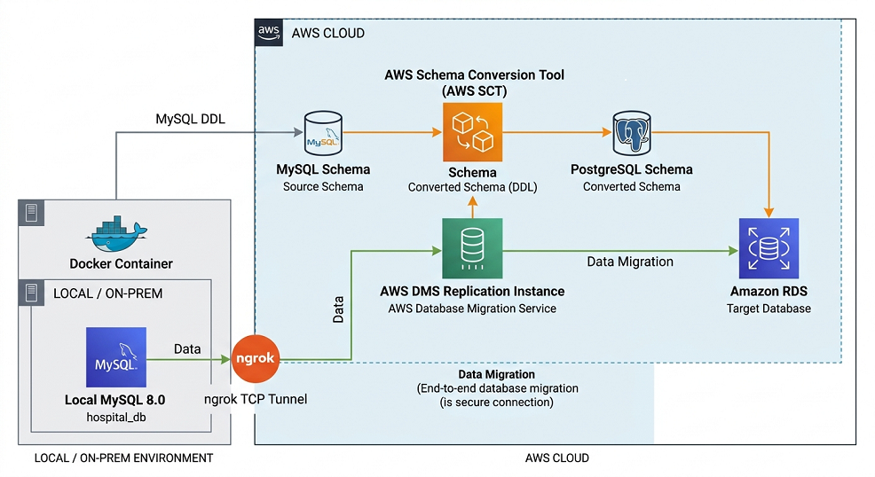

# 🏥 Hospital Database Migration: MySQL to Amazon RDS PostgreSQL


A hands-on cloud database migration project demonstrating how a locally hosted MySQL healthcare database can be migrated to **Amazon RDS PostgreSQL** using **AWS Database Migration Service (DMS)**, with schema conversion, validation, containerization, and CI/CD.

---

## 📑 Table of Contents

* [Project Overview](#-project-overview)
* [Business Scenario](#-business-scenario)
* [Project Objectives](#-project-objectives)
* [Technology Stack](#-technology-stack)
* [Solution Architecture](#-solution-architecture)
* [Migration Workflow](#-migration-workflow)
* [Source Database](#-source-database)
* [Schema Conversion](#-schema-conversion)
* [AWS DMS Migration](#-aws-dms-migration)
* [Target Database](#-target-database)
* [Data Validation](#-data-validation)
* [CI/CD](#-cicd)
* [Project Structure](#-project-structure)
* [Migration Evidence](#-migration-evidence)
* [Project Outcomes](#-project-outcomes)

---

# 🚀 Project Overview

This project simulates a real-world **on-premises to cloud database migration** for a hospital data platform.

The source system is a Dockerized **MySQL 8.0 database** containing hospital-related data such as patients, encounters, payers, and procedures.

The database is migrated to **Amazon RDS for PostgreSQL** using **AWS Database Migration Service (DMS)**.

The project also demonstrates:

* Database schema conversion using AWS SCT
* Secure connectivity between a local database and AWS DMS using an ngrok TCP tunnel
* Full-load database migration
* Source-to-target data validation
* Docker-based local database setup
* Git-based version control
* GitHub Actions CI validation

The goal is to demonstrate the complete migration workflow rather than simply moving data from one database to another.

---

# 🏥 Business Scenario

A healthcare organization currently operates a MySQL database in an on-premises environment.

The organization wants to modernize its database infrastructure by moving the workload to AWS while preserving the existing data.

The migration needs to:

1. Move the existing MySQL database to AWS.
2. Convert the MySQL schema to PostgreSQL.
3. Preserve the existing tables and data.
4. Validate that the migrated data matches the source.
5. Establish a repeatable and documented migration process.
6. Maintain the migration configuration in source control.

---

# 🎯 Project Objectives

* Migrate MySQL data to Amazon RDS PostgreSQL.
* Use AWS DMS for database migration.
* Use AWS SCT for schema conversion.
* Establish connectivity between the local database and AWS.
* Perform a full-load migration.
* Validate source and target row counts.
* Containerize the source database using Docker.
* Store migration configurations in Git.
* Implement CI checks using GitHub Actions.
* Document the architecture and migration process.

---

# 🛠 Technology Stack

| Technology                | Purpose                                      |
| ------------------------- | -------------------------------------------- |
| **MySQL 8.0**             | Source database                              |
| **Docker**                | Local database containerization              |
| **ngrok TCP Tunnel**      | Connectivity between local MySQL and AWS DMS |
| **AWS DMS**               | Database migration                           |
| **AWS SCT**               | Schema conversion                            |
| **Amazon RDS PostgreSQL** | Target database                              |
| **DBeaver**               | Database management and validation           |
| **Git**                   | Version control                              |
| **GitHub**                | Source-code repository                       |
| **GitHub Actions**        | CI validation                                |

---

# 🏗 Solution Architecture


```

### Architecture Flow

**Source → Connectivity → Migration → Target → Validation**

```text
MySQL
  ↓
ngrok TCP Tunnel
  ↓
AWS DMS
  ↓
Amazon RDS PostgreSQL
  ↓
DBeaver Validation
```

AWS SCT is used as the schema-conversion component before the migration, while GitHub Actions validates the project configuration and supporting files.

---

# 🔄 Migration Workflow

The migration was completed using the following workflow:

### 1. Create the source database

A MySQL 8.0 database was deployed locally using Docker.

```text
Docker
   ↓
MySQL 8.0
   ↓
hospital_db
```

The database contains the following core tables:

* `patients`
* `encounters`
* `payers`
* `procedures`

---

### 2. Establish connectivity

Because the source MySQL database was running locally, an **ngrok TCP tunnel** was used to expose the MySQL TCP connection to AWS DMS.

```text
Local MySQL
     ↓
Port 3306
     ↓
ngrok TCP Tunnel
     ↓
AWS DMS
```

This allowed AWS DMS to communicate with the locally hosted database.

---

### 3. Convert the database schema

AWS Schema Conversion Tool (SCT) was used to convert the MySQL schema into a PostgreSQL-compatible schema.

```text
MySQL Schema
     ↓
AWS SCT
     ↓
PostgreSQL Schema
```

The converted PostgreSQL schema is stored in:

```text
schema/postgres_schema.sql
```

The original MySQL schema is stored in:

```text
schema/mysql_schema.sql
```

---

### 4. Configure AWS DMS

AWS DMS was configured with:

* Source endpoint → local MySQL through ngrok
* Target endpoint → Amazon RDS PostgreSQL
* Replication instance
* Full-load migration task
* Table selection rules

The DMS configuration files are stored under:

```text
dms/
```

---

### 5. Run the migration

The AWS DMS migration task performed a **full load** of the selected tables.

```text
MySQL
  │
  │ Full Load
  ▼
AWS DMS
  │
  ▼
RDS PostgreSQL
```

---

### 6. Validate the migrated data

After migration, the source and target databases were queried using DBeaver.

Row counts were compared across the migrated tables to confirm that the data successfully reached the PostgreSQL target.

---

# 🗄 Source Database

The source database runs locally inside Docker.

### Database

```text
Database: hospital_db
Engine: MySQL 8.0
```

### Tables

```text
hospital_db
│
├── patients
├── encounters
├── payers
└── procedures
```

The Docker configuration is defined in:

```text
docker-compose.yml
```

---

# 🔄 Schema Conversion

The source system uses MySQL while the target system uses PostgreSQL.

Because the two database engines have different SQL dialects, data types, and schema definitions, the schema was converted before migration.

### Conversion Flow

```text
MySQL
  │
  │ AWS SCT
  ▼
PostgreSQL
```

Schema files:

```text
schema/
├── mysql_schema.sql
└── postgres_schema.sql
```

This keeps both the original and converted schemas available for review and reproducibility.

---

# ☁️ AWS DMS Migration

AWS Database Migration Service was used as the migration engine.

### DMS Components

```text
Source Endpoint
      ↓
Replication Instance
      ↓
Migration Task
      ↓
Target Endpoint
```

### Source

```text
MySQL 8.0
hospital_db
```

### Target

```text
Amazon RDS PostgreSQL
postgres
```

### Migration Type

```text
Full Load
```

### Table Selection

The DMS table mapping includes the hospital database tables using a selection rule for the source schema.

Configuration files:

```text
dms/
├── source_endpoint_settings.json
├── Target_endpoint_settings.json
└── table_mappings.json
```

> **Security Note:** Endpoint configuration files in this repository use sanitized values/placeholders. No passwords, AWS credentials, private keys, or other secrets are stored in the repository.

---

# 🐘 Target Database

The target database is hosted on **Amazon RDS for PostgreSQL**.

```text
Amazon RDS
     ↓
PostgreSQL
     ↓
postgres database
```

The migrated tables include:

* `patients`
* `encounters`
* `payers`
* `procedures`

The PostgreSQL schema generated during schema conversion is stored in:

```text
schema/postgres_schema.sql
```

---

# ✅ Data Validation

Migration completion was verified by comparing source and target data.

Validation was performed using **DBeaver**.

### Source Validation

```sql
SELECT 'patients' AS table_name, COUNT(*) AS row_count
FROM patients

UNION ALL

SELECT 'encounters', COUNT(*)
FROM encounters

UNION ALL

SELECT 'payers', COUNT(*)
FROM payers

UNION ALL

SELECT 'procedures', COUNT(*)
FROM procedures;
```

The same tables were queried on the PostgreSQL target.

### Validation Process

```text
MySQL Source
     │
     │ Row Counts
     ▼
DBeaver
     │
     │ Compare
     ▼
PostgreSQL Target
     │
     │ Row Counts
     ▼
Validation Result
```

The validation query is stored in:

```text
validation/row_count_validation.sql
```

### Validation Evidence

#### Source MySQL


#### Target PostgreSQL


#### AWS DMS Table Statistics


---

# 🔁 CI/CD

GitHub Actions is used to validate the project whenever changes are pushed to the `main` branch or submitted through a pull request.

The CI workflow validates:

* JSON configuration files
* Docker Compose configuration
* SQL files
* Required project directories

Workflow:

```text
Git Push / Pull Request
          ↓
    GitHub Actions
          ↓
 ┌─────────────────────┐
 │ JSON Validation     │
 │ Docker Validation   │
 │ SQL Checks          │
 │ Project Structure   │
 └─────────────────────┘
          ↓
       PASS / FAIL
```

The workflow is located at:

```text
.github/workflows/CI.yml
```

### Important

The CI pipeline validates the migration project's configuration and structure. It does **not** automatically execute the AWS DMS migration.

---

# 📁 Project Structure

```text
hospital-db-migration-aws/
│
├── .github/
│   └── workflows/
│       └── CI.yml
│
├── dms/
│   ├── Target_endpoint_settings.json
│   ├── source_endpoint_settings.json
│   └── table_mappings.json
│
├── schema/
│   ├── mysql_schema.sql
│   └── postgres_schema.sql
│
├── validation/
│   └── row_count_validation.sql
│
├── docs/
│   └── screenshots/
│       ├── mysql-validation.png
│       ├── postgres-validation.png
│       ├── dms-table-statistics.png
│       ├── migration-task.png
│       └── replication-instance.png
│
├── docker-compose.yml
├── .gitignore
└── README.md
```

---

# 📸 Migration Evidence

The repository contains screenshots documenting the migration process, including:

### AWS DMS Replication Instance


### AWS DMS Migration Task


### DMS Table Statistics


### Source Database Validation


### Target Database Validation


These screenshots provide visual evidence of the migration and validation process.

---

# 📊 Project Outcomes

The project demonstrates an end-to-end database migration workflow covering:

* ✅ Local MySQL database deployment
* ✅ Docker containerization
* ✅ Local-to-cloud database connectivity
* ✅ MySQL → PostgreSQL schema conversion
* ✅ AWS DMS configuration
* ✅ Full-load migration
* ✅ Amazon RDS PostgreSQL deployment
* ✅ Source-to-target validation
* ✅ Migration evidence and documentation
* ✅ Git version control
* ✅ GitHub Actions CI validation

The result is a documented and reproducible example of migrating a traditional MySQL workload into a managed PostgreSQL environment on AWS.

---

# 🔐 Security

Sensitive information is intentionally excluded from this repository.

The project uses:

* `.gitignore` for local secrets and credentials
* Sanitized DMS endpoint configuration
* Placeholder values for infrastructure-specific connection details
* No AWS access keys or passwords committed to Git

Example:

```json
{
  "ServerName": "<NGROK_HOST>",
  "Port": "<NGROK_PORT>",
  "Username": "<USERNAME>"
}
```

---

# 👨🏽‍💻 Author

**Solomon Ojukotimi**

Data Engineer | Cloud & Data Migration

This project was built to demonstrate practical experience with cloud database migration, data engineering workflows, AWS infrastructure, data validation, and CI/CD practices.
